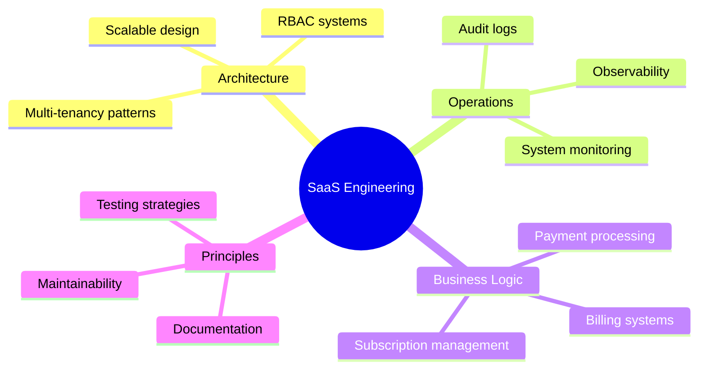

<div align="center">
  
</div>

<div align="center">
  
### Building SaaS Systems, APIs & Scalable Architectures

[](https://www.linkedin.com/in/emmanuel-oghene/)
[](mailto:emmanueloghene72@gmail.com)
[](https://emmathedev-chi.vercel.app)
[](https://github.com/OgheneDev)

</div>

---

##  About Me

I build and maintain **production web systems** with a focus on:

<table>
<tr>
<td width="50%">

```yaml
Backend Focus:
  ├─ Architecture & Data Modeling
  ├─ Authentication & Authorization
  ├─ Multi-tenant Patterns
  └─ Real-time Systems
```

</td>
<td width="50%">

```yaml
Engineering Principles:
  ├─ Maintainable Code
  ├─ Scalable Design
  ├─ System Observability
  └─ Production Readiness
```

</td>
</tr>
</table>

<div align="center">
  
</div>

---

##  Tech Stack

<details open>
<summary><b>Core Backend</b></summary>
<br/>


- REST APIs & WebSockets architecture
- JWT-based authentication & RBAC
- Real-time communication systems

</details>

<details open>
<summary><b>Data & State Management</b></summary>
<br/>


- Schema design & indexing strategies
- Query optimization & performance
- Real-time data synchronization

</details>

<details open>
<summary><b>Frontend (Supporting)</b></summary>
<br/>


</details>

<details open>
<summary><b>Development Tools</b></summary>
<br/>


</details>

<div align="center">
  
</div>

---

##  Featured Projects

###  FlowChat — Real-Time Messaging System
**2025** | Production-grade messaging architecture

<table>
<tr>
<td width="60%">

**Key Features:**
- WebSocket-based messaging (private & group)
- Complete message lifecycle (edit, delete, pin, forward)
- Role-based permissions system
- Read receipts & delivery tracking
- Unread count management
- Real-time + REST API consistency

</td>
<td width="40%">

**Technologies:**


</td>
</tr>
</table>

---

###  Technest — E-Commerce Platform
API-driven commerce system with secure payments

<table>
<tr>
<td width="60%">

**Key Features:**
- RESTful API architecture
- Paystack payment integration
- JWT authentication & RBAC
- Admin CRUD workflows
- Relational data modeling
- Server-side payment verification

</td>
<td width="40%">

**Technologies:**


</td>
</tr>
</table>

---

###  TaskMaster — Productivity & Scheduling System
**2023** | Handling 10k+ task records with automated workflows

<table>
<tr>
<td width="60%">

**Key Features:**
- Optimized MongoDB schemas
- Background job scheduling
- Email notification system
- Authentication & password recovery
- Analytics endpoints
- Query performance optimization

</td>
<td width="40%">

**Technologies:**


</td>
</tr>
</table>

---

##  Professional Experience

###  Full-Stack Developer — Rheel Estate Limited
`Nov 2024 – Apr 2025`

```typescript
const impact = {
  apiDevelopment: "Built & maintained APIs for 500+ property listings",
  performance: "Improved data-fetching strategies for better UX",
  automation: "Reduced manual communication workflows by 30%",
  architecture: "Implemented SSR for SEO and reliability"
};
```

###  Full-Stack Developer — Migho Invest Limited
`Jun 2022 – Sep 2023`

```typescript
const contributions = {
  backend: "Developed secure backend systems for real estate operations",
  security: "Implemented authentication & authorization flows",
  architecture: "Translated business rules into maintainable logic",
  mentorship: "Guided junior developers on API best practices"
};
```

---

##  Current Focus

<div align="center">



</div>

---

##  GitHub Analytics

<div align="center">
  
  
</div>

---

<div align="center">
  
###  Let's Connect

**Open to discussing backend architecture, SaaS systems, and engineering opportunities**

[](https://www.linkedin.com/in/emmanuel-oghene/)
[](mailto:emmanueloghene72@gmail.com)
[](https://github.com/OgheneDev)
[](https://emmathedev-chi.vercel.app)

---

 *"Good software is built twice: once in design, once in code."*


</div>
